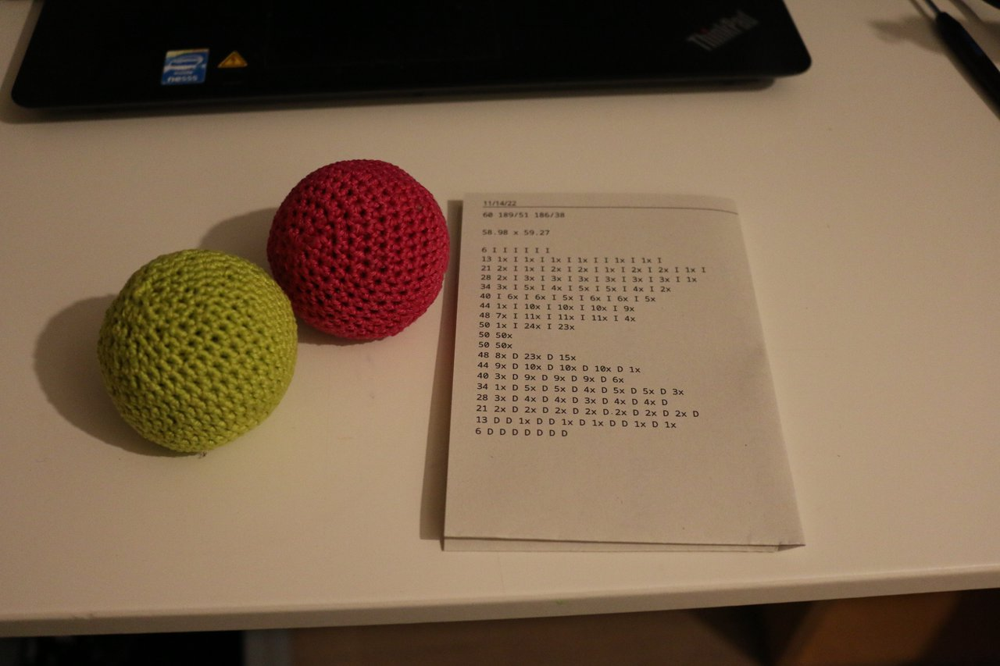

# sphere_crochet
A script to generate step-by-step crochet guides for spheres.
 

## usage
After starting main.py (`python main.py`) you'll be asked for the desired height of your sphere and the width/height of your stitches. Since stitch dimensions vary depending on yarn and technique, it's recommended to do a test piece and measure across multiple stitches ("Maschenprobe").
The printed output will contain one line per row. 
It's intended for the rows to be crocheted without switching directions.
### guide format
The letters in the guid correspond to different stitches: 
`5x` = 5 regular stitches 
`I` = one increment (put two stitches into one) 
`D` = one decrement (skip one stitch) 

## results :)
 
